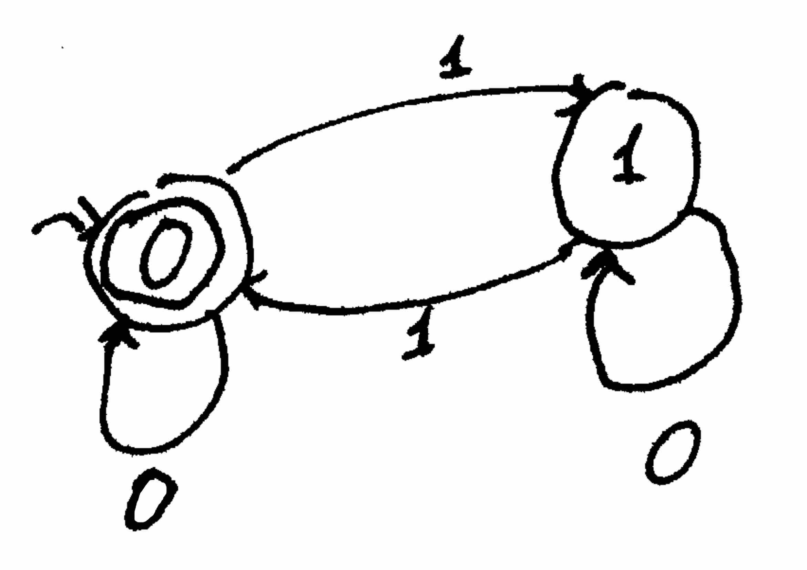
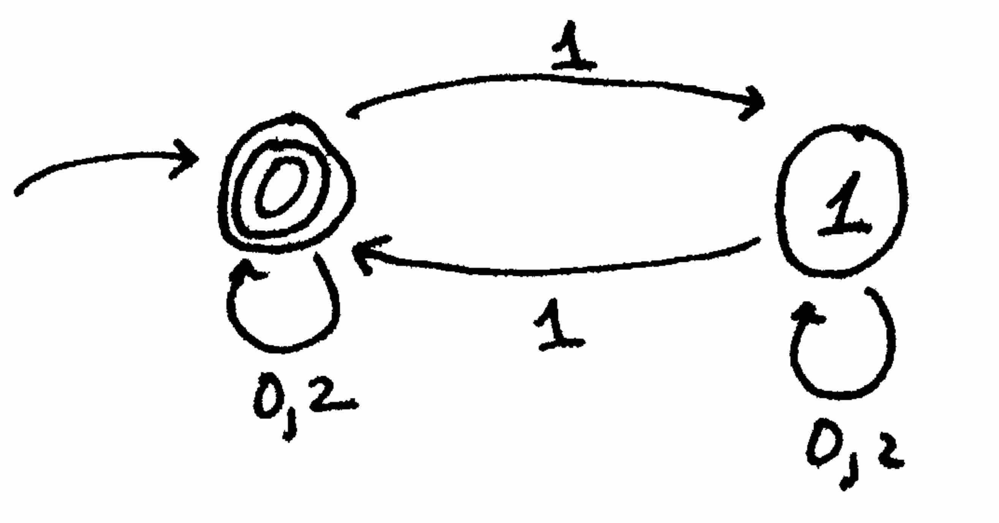
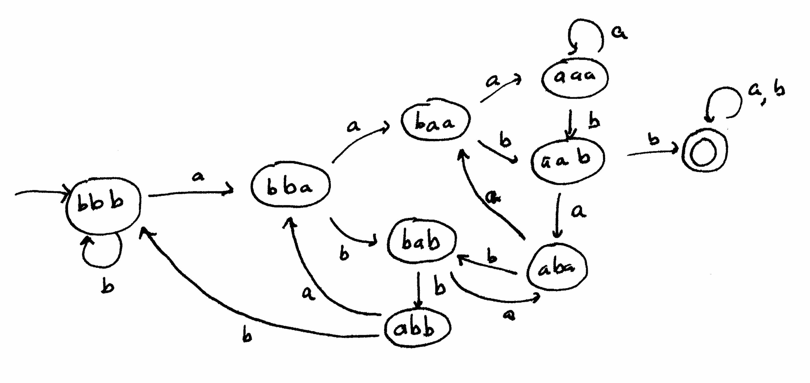

**Administrivia:** Homework 1 is now available online [here](http://www.cs.berkeley.edu/~luca/cs172/homework1.pdf) and must be submitted as a PDF via bCourses by Friday, 30 January at 1700.

DFAs capture not only regular expressions, but also simple one-pass algorithms. More formally, DFAs capture all algorithms that make one pass through the input and use $$O(1)$$ bits of memory. We will mostly talk about algorithms that output one bit.

As we will see later, there are a lot of things we cannot do with this model (e.g. checking syntatic correctness of anything involving nested parentheses).

###A Few Motivating Examples

**Example:** suppose we are given a string of bits, and we want to check if the number of `1`s is even. We can do this with one parity bit which we initialize to $$0$$ (even) and flipping it whenever we see a `1`.

We have one node for every possible state of the algorithm, whcih is why we have the requirement that our algorithm use only a finite amount of memory.

Each node corresponds to one of our output states (remember that our ouput is only one bit). If we end in a “yes” node (denoted with a double circle), we return yes, else, we return no.

**Example:** Given an integer in base 3, we want to check if it is even; we feed our number into the algorithm starting with the most significant bit. If we did not have a memory restriction, we could just store the entire number in our register; unfortunately, this requires $$O(n)$$ memory, where n is the length of the input.

Let's write this as pseudocode:


m = 0
while not EOF:
    read x
    m <- 3m + x
return m % 2 == 0


Note that if we take a modulus with respect to $$2$$ at each step, we don't change the behavior, but we reduce the memory usage to $$O(1)$$. That leads to this DFA:

**Example:** Given a string of `a`s and `b`s, we want to know whether `aabb` a substring. Here's a naive implementation:


for i = 0 to n-4:
    if s[i:i+3] == "aabb":
        return YES
return NO


One way we can represent this as a DFA is to hold the previous three characters in a buffer initialized to `bbb`.

Notice that in order to encapsulate the program ending prematurely, we make a state that we enter and never leave (all state transitions from it go back to itself).

This is not the most efficient DFA, in terms of number of states, that exists to solve the problem. In future lectures, we will develop a method to determine whether or not a DFA can be reduced to one with fewer states.

###Formalism

Like most computational models we'll discuss in the course, the formal definition of a DFA is a list of data types:

- The data type read at each step, or *alphabet*, is a finite set denoted $$\Sigma$$. The input is string over $$\Sigma$$.
- The (finite) set of states, $$Q$$, specifies how much memory is used.
- In order to specify the “code” of the automaton, we use a *transition function* $$\delta:Q\times\Sigma\rightarrow Q$$ which, given $$q\in Q$$ and a data item $$a\in\Sigma$$, returns a new state $$\delta(q,a)$$.
- A *start state* $$q_{0}$$ which we start off with.
- The set of *final* or *terminal states* $$F\subseteq Q$$ of states that causes the DFA to output YES ($$Q\backslash F$$ are states that return NO).

We also want to specify: *What is a computational problem?* A problem consists of:

- A set $$\Sigma$$ consisting of the alphabet.
- A set of inputs, or *language*, $$L\subseteq\Sigma^{*}$$ (note that this may include the empty string $$\epsilon$$) for which the answer is YES.

**Definition**: If $$L\subseteq\Sigma^{*}$$ is a language and $$M=(Q,\Sigma,\delta,q_{0},F)$$ is a DFA such that:

- For all $$x\in L$$, M, on input $$x$$, reaches a state in $$F$$ (outputs YES), and
- For all $$x\notin L$$, M, on input $$x$$, reaches a state not in $$F$$ (outputs NO),

then $$M$$ *decides* or *recognizes* $$L$$, and $$L$$ is a *regular language*.

**Theorem**: If $$L_{1}\subseteq\Sigma^{*}$$ and $$L_{2}\subseteq\Sigma^{*}$$ are two regular languages, then $$L_{1}\cap L_{2}$$ and $$L_{1}\cup L_{2}$$ are regular. 

Imagine we have two DFAs $$M_{1}$$ and $$M_{2}$$ deciding $$L_{1}$$ and one deciding $$L_{2}$$. Since we can't run them in sequence (that would require rewinding), we want to run them together - that is, the DFA $$M$$ deciding $$L_{1}\cap L_{2}$$ needs to keep track of both of their states.

Formally, let $$M_{1}=(Q_{1},\Sigma,\delta_{1},q_{01},F_{1})$$ and $$M_{2}=(Q_{2},\Sigma,\delta_{2},q_{02},F_{2})$$, define $$M=Q(Q,\Sigma,\delta,q_{0},F)$$ with its components defined as follows:

- $$Q=Q_{1}\times Q_{2}$$
- $$\delta((q_{1},q_{2}),a)=(\delta_{1}(q_{1},a),\delta_{2}(q_{2},a))$$
- $$q_{0}=(q_{01},q_{02})$$
- $$F=F_{1}\times F_{2}$$

To prove that $$M$$ actually accepts $$L_{1}\cap L_{2}$$, we would need to prove (by induction on the length of the input) that $$M$$ actually decides this language; for the purposes of this class, however, a construction of the machine and an intuitive explanation of why it decides the language will suffice.

We can construct an automaton $$M'$$ that decides $$L_{1}\cup L_{2}$$ just like we constructed $$M$$, except that the set of final states is defined by $$F=(F_{1}\times Q_{2})\cup(Q_{1}\times F_{2})$$.

###Preview: NFAs

**Definition:** Let $$s,t\in\Sigma^{*}$$ are strings, then let $$s\circ t$$ denote their concatenation.

**Definition:** If $$L_{1}$$ and $$L_{2}$$ are subsets of $$\Sigma^{*}$$, then let $$L_{1}\circ L_{2}=\{s_{1}\circ s_{2}\mbox{ such that }s_{1}\in L_{1}\mbox{ and }s_{2}\in L_{2}\}$$.

**Theorem:** If $$L_{1}$$ and $$L_{2}$$ are regular, then $$L_{1}\circ L_{2}$$ is regular.

To prove this, what we want is a way to test all possible places where we can split an input string into two pieces which we can test using automata for $$L_{1}$$ and $$L_{2}$$, without needing to backtrack.

In the next lecture, we will define the *nondeterministic finite automaton*, or NFA, and prove that there is an NFA that decides a language $$L$$ if and only if there is a DFA that decides it. We will complete the proof by proving that if $$L_{1}$$ and $$L_{2}$$ are decidable by NFAs, then so is $$L_{1}\circ L_{2}$$.
