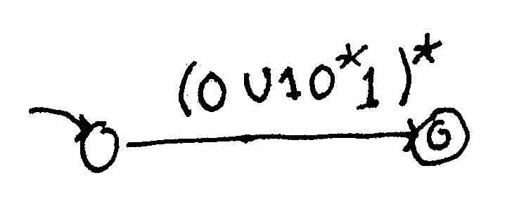

**INCOMPLETE:** Figures are currently being scanned.

Recall that If $$L_{1}$$ and $$L_{2}$$ are regular languages - that is, we can create an automaton that decides $$L_{1}$$ and $$L_{2}$$ , then so are $$L_{1}\cup L_{2}$$ , $$L_{1}\circ L_{2}$$ , and $$L^{*}$$.

This leads to define *regular expressions* as follows:

- $$\textrm{Ø}$$ is a regular expression, which represents the empty language $$\{\}$$.

- $$\epsilon$$ is a regular expression representing the language $$\{\epsilon\}$$.

- For all characters $$a\in\Sigma$$, $$a$$ is a regular expression representing $$\{a\}$$.

If $$E_{1}$$ and $$E_{2}$$ are regular expressions describing languages $$L_{1}$$ and $$L_{2}$$ respectively, then:

- $$E_{1}\cup E_{2}$$ is a regular expression representing $$L_{1}\cup L_{2}$$.

- $$E_{1}\circ E_{2}$$ is a regular expression representing $$L_{1}\circ L_{2}$$.

- $$E_{1}^{*}$$ is a regular expression representing$$ L_{1}^{*}$$. 

In some texts the union operation is denoted as multiplication (i.e. $$a\cup b\equiv ab$$) and $$E_{1}\circ E_{1}^{*}$$ is abbreviated $$E_{1}+$$.

###Regular Expressions and Automata

It turns out that regular expressions are equivalent to automata: that is, one can construct a regular expression to describe a language if and only if one can construct a finite automata that describes that language.

Let's suppose we have this DFA which accepts bitstrings that have an even number of `1`s.

It should be fairly obvious that the regular expression $$0^{*}\circ(0^{*}\circ1\circ0^{*}\circ1\circ0^{*})$$ accepts this language as well.

####Aside: Generalized NFAs

Before we find a general way to take automata and turn them into regular expressions, we'll define the *generalized NFA*: an NFA whose transitions are labeled by regular languages:

The GNFA accepts if and only if there is a path from the start state to a final state such that if we concatenate the regular expressions that form the labels of edges along the path, we get a regular expression that matches the input. For instance, this automaton will accept `aaabbab` (through the regular expression $$a^{*}b\circ\epsilon\circ bab$$) but not `a`.

Since single characters are also regular expressions, ordinary NFAs are also GNFAs. They also generalize regular expressions using this trivial GNFA:

We will state that a GNFA is in *normal form* if the following three properties hold:

- there is only one accept state,

- the start state only outgoing transitions, and

- the accept state has only incoming transitions.

It is obvious that a normal GNFA with two states has only one transition - the one from the start state to the accepting state - and the language accepted by the GNFA is exactly the one described by the regular expression of unique transition.

---

With these definitions, we'll proceed to prove the equivalence between automata and NFAs.

**Lemma:** given a normal form GNFA with $$k\ge3$$ states, we will construct an equivalent one with $$k-1$$ states.

Assuming the lemma for now, the remainder of the proof works as follows: given a DFA, for instance:

we turn it into a normal form GNFA by creating a new start state, connecting it to the old start state with an $$\epsilon$$-transition, and creating a new final state and creating $$\epsilon$$-transitions from the final states of the original DFA to the new state:

and repeatedly construct an equivalent GNFA with one fewer state (whose existence is guaranteed by the lemma) until the number of states is two, at which point we have a regular expression that describes the language.

It now sufficies to prove the lemma.

Suppose we have a normal form GNFA $$M$$ with $$k\ge3$$ states.

Pick a state $$q$$ that is not the start state or a final state and eliminate it.

Modify the transitions: for every two states $$A$$, $$B$$, where there exists some transition $$A\rightarrow q\rightarrow B$$ replace the $$A\rightarrow B$$ transition (or add it, if it does not already exist), as follows:

and for every case where we have $$A\rightarrow q\rightarrow A$$, modify the $$A\rightarrow A$$ transition (or add it if it does not already exist) as follows:

####Example: the parity DFA

Let's find a regular expression for our old friend, the parity DFA, using the method above.

We start with the parity DFA

Turn it into a normal form GNFA:

Now remove the rightmost state:

Now remove the rightmost state:

which gives us the regular expression $$(0\cup10^{*}1)^{*}$$.

---

We hae a number of equivalent views of computation representing one-pass algorithms that can be done with constant memory, and have algorithmic ways to translate between them.

[pic from phone]

###Limits of automata

What are we unable to parse with regular expressions?

One limitation is inability to handle nested expressions. It is impossible, for instance, to deal with the language of properly matched parentheses, i.e. the one defined as follows:

- $$\epsilon\in L$$ 

- $$s,t\in L$$ implies $$s\circ t\in L$$ 

- $$s\in L$$ implies $$(s)\in L$$ 

Why can't this be recognized by an automaton? Intuitively: Let's imagine a simple algorithm for dealing with this: keep a counter initialized at $$0$$, increment it when we seee a `(` and decrement it when we see a `)`. If at any time the counter drops below $$0$$, return NO; at the end of the string, return YES if the counter is exactly $$0$$ and return NO otherwise. The issue is that the counter takes up to $$O(\log n)$$ space where $$n$$ is the length of the input (since we have to store an integer of size up to $$n$$). DFAs can't handle non-constant memory.

Formally: suppose for contradiction $$L$$ is regular. Then there exists a DFA $$M$$ that decides it. Let $$k$$ be the number of states of $$M$$ . Consider the state reached by $$M$$ in each of the following $$k+1$$ cases: `(`, `((`, `(((`, etc. up to $$k+1$$ consecutive `(`s. By the pigeonhole principle, there must be two input strings comprised of different numbers of consecutive `(`s (let's call their lengths $$a$$ and $$b$$, with $$a\neq b$$) that both make $$M$$ reach the same state. Now imagine we append the string comprised of $$a$$ consecutive `)`s to both of those strings. Since the DFA is in the same state once the open parentheses are all read, and the strings are identical thereafter, either both strings must be accepted or both must be rejected; this is obviously erroneous, so $$L$$ cannot be regular.
