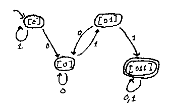
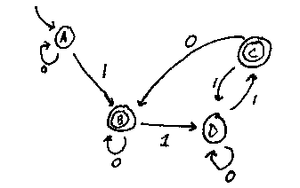

**Administrivia:** Today's office hours have been moved to tomorrow, 1000-1130.

Today, we'll examine:

- How to prove when a language is not regular
- How to find a DFA with a minimum number of state for a regular language.

Recall from last lecture that we showed that the language of properly matched parentheses is not a regular language.

There are two main ways we can show that a language is not irregular. One way, described in the book, is the *pumping lemma*. We will cover another method, the *Myhill-Nerode theorem*, today.

**Definition:** If $$M=(Q,\Sigma,\delta,q_{0},F)$$, we define: 

$$\delta^{*}(q,s)=\begin{cases}
\delta^{*}(q,\epsilon)=q\\
\delta^{*}(q,s\circ a)=\delta(\delta^{*}(q,s),a)
\end{cases}$$ 

Using this notation, we can restate the proof of the irregularity of the language of properly matched parentheses as follows: $$\delta^{*}(q,\epsilon)$$, $$\delta^{*}(q_{0},\mbox{(})$$, $$\delta^{*}(q_{0},\mbox{((})$$, etc. cannot all be different if $$M$$ is a DFA, but they all have to be different because if $$\delta^{*}(q_{0},\mbox{ a ('s })=\delta^{*}(q_{0},\mbox{ b ('s })$$, then $$\delta^{*}(q_{0},\mbox{ a ('s }\circ\mbox{ a )'s })=\delta^{*}(q_{0},\mbox{ b ('s }\circ\mbox{ a )'s })$$. 

**Definition:** If $$L=\subseteq\Sigma^{*}$$ is a language, two strings $$s_{1}$$ and $$s_{2}$$ in $$\Sigma^{*}$$ are distinguishable if there exists $$t$$ in $$\Sigma^{*}$$ such that one of $$s_{1}\circ t$$ and $$s_{2}\circ t$$ is in $$L$$ and the other is not.

**Fact:** if $$M$$ decides $$L$$ and $$s_{1},s_{2}$$ are distinguishable, then $$\delta^{*}(q_{0},s_{1})\neq\delta^{*}(q_{0},s_{2})$$.

**Proof:** if not, $$\delta^{*}(q_{0},s_{1}\circ t)=\delta^{*}(q_{0},s_{2}\circ t)$$ which contradicts the correctness of $$M$$. $$\blacksquare$$

If $$s_{1,}...,s_{k}$$ are $$k$$ strings all pairwise distinguishable with respect to a language $$L$$ , then either $$L$$ is not regular, or every automaton for $$L$$ needs to have at least $$k$$ states.

If $$s_{1},...,s_{n},...$$ is an infinite set of pairwise distinguishable strings with respect to a language $$L$$, then $$L$$ is not regular.

We wish to prove that the maximum number of distinguishable strings is the number of states of the automaton.

We'll start by making a more intuitive approach to distinguishable:

**Definition:** $$s_{1}$$ and $$s_{2}$$ are indistinguishable with respect to $$L$$ if for all strings $$t$$, $$s_{1}\circ t\in L$$ if and only if $$s_{2}\circ t\in L$$. We denote indistinguishable strings using the following notation: $$s_{1}\equiv_{L}s_{2}$$.

It is trivial to show that $$\equiv_{L}$$ is an equivalence relation in $$\Sigma^{*}$$.

###The Myhill-Nerode Theorem

**Theorem (Myhill-Nerode):** The number of equivalence classes of $$\equiv_{L}$$ is the same as the number of states of the minimum DFA for $$L$$.

The MN theorem can be split up into three parts;

- If $$\equiv_{L}$$ has infinitely many equivalence classes, $$L$$ is irregular.

- If $$\equiv_{L}$$ has $$k$$ classes, every DFA for $$L$$ has at least $$k$$ states.

- If $$\equiv_{L}$$ has a finite number $$k$$ of classes, $$L$$ is regular and there exists a DFA for $$L$$ with $$k$$ states.

We have already established the first two. We now wish to prove the third.

####Example

Let $$L\subseteq\{0,1\}^{*}$$ be the set of strings that contain `011` as a substring.

There are four equivalence classes, which we can discover by examination:

- Strings in `1*`, e.g. $$\epsilon$$, `1`, `11`, `111`
- Strings not in $$L$$ ending in `0`, such as `0`,`00`, `10`, `000`, `010`, `100`, `110`, `0000`, `0010`
- Strings not in $$L$$ ending in `01`, such as `01`, `001`, `101`, `0001`
- One containing all strings in $$L$$, which we can append $$\epsilon$$ to and still be in the language.

**Notation:** let $$[s]$$ denote $$\{s':s'\equiv_{L}s\}$$ .

We can construct a DFA by observing that each state $$[s]$$, when presented with the character `a`, transitions to $$[sa]$$. In this case, we get the following DFA:

---

We want to prove that this process results in the *smallest* DFA that accepts that language. It suffices to prove that $$\delta^{*}(q_{0},s)=[s]$$.

We will use induction on the length of the string.

For the base case, in which $$s=\epsilon$$, it is obvious that $$s^{*}(q_{0},\epsilon)=q_{0}$$.

Suppose for induction that $$\delta^{*}(q_{0},s)=[s]$$ for strings $$s$$ of length less than or equal to $$k$$. Let $$s=s'a$$. Then $$\delta^{*}(q_{0},s'a)=\delta(\delta^{*}(q_{0},s'),a)$$; by the inductive hypothesis, this is $$\delta([s'],a)=[s'a]$$.

We must now verify that our process actually creates a DFA: that is, given a state that contains strings $$a$$ and $$b$$ , we must ensure that for all chracters $$k$$ , $$ak$$ and $$bk$$ are in the same state so we don't end up with an NFA. In other words, we wish to show that if $$s_{1}\equiv_{L}s_{2}$$ (that is: $$\forall t:s_{1}t\in L\iff s_{2}t\in L$$), then $$s_{1}a\equiv_{L}s_{2}a$$ (that is: $$\forall t:s_{1}at\in L\iff s_{2}at\in L$$. But this is obvious (just let $$t$$ in the condition be $$at$$ in the implication). $$\blacksquare$$

###Finding minimal automata

We now turn attention to finding the smallest automata that accepts a certain language.

Our approach: given a DFA, either prove that it is the smallest automaton that accepts the language, or find an automaton with fewer states that recognizes hthe same language).

**Definition:** For each state $$q$$ of a DFA $$M$$, let $$S_{q}=\{s:\delta^{*}(q_{0},s)=q\}$$.

For instance, given this automaton:

$$S_{A}=\{\epsilon,0,00,...\}$$ and $$S_{B}=\{1,01,0100,...\}$$.

If $$L$$ is the language decided by $$M$$ and $$s_{1},s_{2}\in S_{q}$$, then $$s_{1}\equiv_{L}s_{2}$$. What this says is that the $$S_{q}$$s are a refinement of the partitioning of the language into equivalence classes over $$\equiv_{L}$$.

Our approach, which we will complete in the next lecture, will be to algorithmically figure out which $$S_{q}$$s can be merged together in order to exactly match an equivalence class.
