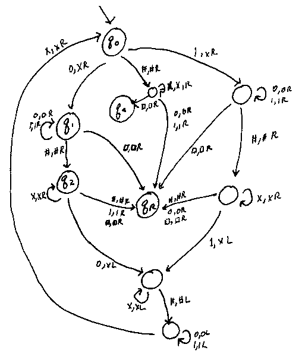

This lecture marks the beginning of the second part of the course, in which we will prove that there exist problems that are unsolvable even if we put no limits on the power of our models.

To do so, we need a mathematical model for completely general algorithms. In this class, we'll use Turing machines, an algorithmic model which is simple to describe and provides easy ways to examine running time, at the cost of being difficult to program.

The Turing machine is by no means the only computational model. Untyped functional languages as well (e.g. lisp), which can be abstracted into lambda-calculus are another; these models are reasonably easy to program and can be described mathematically, at the cost of more difficult runtime analysis and more difficulty in expressing efficient algorithms.

Another (less often used) approach is to model algorithms using a subset of a real-world non-functional programming language such as C - this is extremely difficult to describe mathematically, but provides an easy way to program and describe running time, as is done in *A Programming Approach to Computability* by Kfoury, Moll, Arbib.

Any of these models can be used to simulate each other, meaning that they are equivalent in power.

###The Turing Machine

A Turing machine is can be pictured as a manipulator machine that is attached to a tape of infinite length populated with symbols; at the beginning of the program, the tape is only populated with the input to the program (with all other cells bearing an empty symbol).

The machine is not only capable of reading from the input but also writing to it, and has the capability to rewind the tape in order to make as many passes over the input (or data that the machine itself stored) as it wants.

Formally, a Turing machine is specified by:

- a set $$Q$$ of states.
- a finite set $$\Sigma$$; the input string is in $$\Sigma^{*}$$. 
- a finite set $$\Gamma\supseteq\Sigma\cup\{\square\}$$ of symbols that can be written on the tape.
- a transition function $$\delta:Q\times\Gamma\rightarrow Q\times\Gamma\times\{L,R\}$$: in any possible situation (fully specified by the current state of the machine and the current character), the transition functions tell the machine whether to move one step left or right ($$L$$ or $$R$$), what new state to enter, and what character to write on the current cell of the tape.
- an initial state $$q_{0}\in Q$$
- halting states $$q_{A},q_{R}\in Q$$ representing accept or reject respectively.

####An example problem

Given an alphabet $$\Sigma=\{0,1,\#\}$$, we want to recognize the (irregular) language $$L=\{s\#s:s\in\{0,1\}^{*}\}$$.

We'll start with  $$s_{1}s_{2}...\#s'_{1}s'_{2}...$$ on the tape, with our machine pointing at $$s_{1}$$, and we want to check if $$s_{1}=s_{1}'$$, $$s_{2}=s_{2}'$$, etc.

Let $$\Gamma=\{0,1,\#,\square,X\}$$.

Intuitively, we'll define our transition function as follows: we'll remember whether our current character is a $$1$$ or a $$0$$ using one of the states of the machine, mark the current character as read by overwriting it with an $$X$$, then search right until we find a $$\#$$, then continue searching right for the first $$0$$ or $$1$$. If it doesn't match our stored state, we'll reject; otherwise, we'll mark the current cell as read, and then return to the first unread character remaining. If there are no unread characters left of the $$#$$ we will make sure that there are no unread characters to the right (just search right until we see a $$\square$$); if that is the case, we accept; otherwise, we reject.

We can describe the turing machine with this DFA-like diagram. Note that the labels have more characters than a DFA; here, we use the format `read, write move`, where `read` is the character read, `write` is the character to write, and `move` is either an $$L$$ or $$R$$ indicating how we move. For instance `0,1R` means “if we read a `0` in our current state, write a `1` and then move one cell right.”

We also (for convenience) use the convention that if we show no transition for a certain character, then meeting it immediately sends the machine into reject state.

---

A turing machine $$M$$ on an input $$x$$ may:

- halt and accept, first time $$q_{a}$$ is reached
- halt and reject, first time $$q_{R}$$ is reached
- never halt

$$L\subseteq\Sigma^{*}$$ is *decided* by a Turing machine $$M$$ if for all $$x\in L$$ and $$y\notin L$$, $$M$$ accepts on input $$x$$ and rejects on input $$y$$.

$$L\subseteq\Sigma^{*}$$ is *recognized* by a Turing machine $$M$$ if for all $$x\in L$$ and $$y\notin L$$, $$M$$ accepts on input $$x$$ and does not accept on input $$y$$.

Note the difference between recognizability and decidability: a string not in the language must cause a reject if the language is decidable, but for recognizability, it suffices for that string to cause the turing machine to enter an infinite loop.

###Minor modifications to TMs

There are many small modifications we can make to Turing machines that do not change the power of the model.

For instance, imagine a doubly-infinite tape where there is no end to the tape in either direction. If our double-infinite TM has an alphabet $$\Gamma$$, then we can simulate it with a normal singly-infinite TM by switching the tape alphabet to $$\Gamma\times\Gamma
 $$ and using the states of the machine to store whether we should use the first symbol (corresponding to the right side of the doubly-infinite tape) or the second (corresponding to the left side).

Similarly, consider a turing machine with two tapes where the transition function is $$\delta:Q\times\Gamma\times\Gamma\rightarrow Q\times\Gamma\times\Gamma\times\{L,R\}\times\{L,R\}$$ . We can simulate this TM with a single-tape turing machine where our tape alphabet is $$\Gamma\times\{\circ,\bullet\}\times\Gamma\times\{\circ,\bullet\}$$, where the $$\circ$$ and $$\bullet$$ marks which states are active in the original machine. This single-tape TM can simulate a double-tape TM in quadratic time, since in time t on the double-sided tape, we can cover at most $$t$$ cells, which means that each step (out of $$t$$) in our single-tape TM must take at most $$t$$ time, so the entire simulation must take $$t^{2}$$ time.
