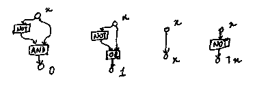
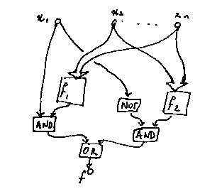

**Note:** There are some placeholders for images below. Due to severe time constraints I won't be able to put them up before the end of the week - if they're not up by Saturday or Sunday, post on the Piazza thread or send me an email and I'll get them up. Thanks!

Today, we will cover circuit satisfiability (CKT-SAT), the first $$\mathbf{NP}$$ problem we will carefully examine in this class.

Recall that we defined $$\mathbf{P}$$ as the set of languages decidable
in time polynomial to the length of the input, and $$\mathbf{NP}$$
as the set of languages $$L$$ that can be expressed as $$L=\{x:\exists y\mbox{ s.t. }(x,y)\in R\}$$
such that $$R$$ is poly-time decidable and $$y$$'s length is polynomial
in the length of $$x$$. We will start by giving an alternative definition
of $$\mathbf{NP}$$.

###An alternative definition of $$\mathbf{NP}$$

**Theorem:** A language $$L$$ is in $$\mathbf{NP}$$ if and only
if $$L$$ is decidable by a polynomial time NDTM.

**Proof:** Recall that $$L$$ is decided by a NDTM in time $$t(n)$$
if for all strings $$x\in\Sigma^*$$, if $$x\in L$$, then there exists
a possible computation of $$M(x)$$ that accepts in at most $$t(\vert x\vert)$$
steps, and if $$x\notin L$$ , then every computation of $$M(x)$$ rejects
in at most $$t(\vert x\vert)$$ steps.

Let $$L$$ be defined as the language of strings $$x$$ such that there
exists $$y$$ such that $$(x,y)\in R$$ where $$R$$ is an $$\mathbf{NP}$$
relation; that is, membership of $$(x,y)\in R$$ can be determined in
polynomial time, and all such $$(x,y)$$ obey the property that $$y$$'s
length is polynomial in the length of $$x$$.

Suppose that $$L\in\mathbf{NP}$$; that is, we have a polynomial-time
decider for $$(x,y)\stackrel{?}{\in}L$$. We will define an NDTM $$M_{L}$$
that decides the input as follows: given an input $$x$$, it calculates
$$l(\vert x\vert)$$, then nondeterministically writes $$y$$ with length
at most $$l(\vert x\vert)$$ after $$x$$ on the tape, then invokes the
polynomial-time decider to check if $$(x,y)\in R$$, accepting if the
decider accepts and rejecting if it rejects.

If there are one or more solutions, then there is some $$y$$ (that
is nondeterministically written) that causes us to accept, so the
NDTM accepts; otherwise, there is no path to an acceptance; therefore,
the NDTM rejects.

Therefore, this NDTM decides $$L$$.

Conversely, suppose that $$L$$ is decidable by a polynomial time NDTM
$$M_{L}$$ in time at most $$t(n)$$, where $$t$$ is a polynomial. Notice
that $$M_{L}$$ accepts the string $$x$$ if and only if there exists
an accepting conputation of $$M_{L}(x)$$; that is, there exists some
sequence $$c_{0},c_{,},...,c_{t(\vert x\vert)}$$ where $$c_{0}$$ is
an initial configuration of $$M(x)$$; $$c_{i+1}$$ is a valid next-step
configuration after $$c_{i}$$ and $$c_{t(\vert x\vert)}$$ is accepting.

Now just define $$R=\{(x,c_{0},c_{1},...,c_{t(\vert x\vert)}\}\mbox{ s.t. \ensuremath{c_{0},...c_{t(\vert x\vert)}}is an accepting computation of \ensuremath{M(x)}}\}$$.

This obviously can be decided in polynomial time, since we can just
check if $$c_{0},...,c_{t(\vert x\vert)}$$ is an accepting computation
of $$M(x)$$ in polynomial time. Furthermore, the length of this sequence
is $$t(\vert x\vert)$$, which is polynomial in $$\vert x\vert$$.

Therefore, $$L\in\mathbf{NP}$$. $$\blacksquare$$

Recall from the previous lecture that we defined a polynomial-time
Karp reduction as follows: $$A\leq_{m}^{p}B$$ if and only if there
exists a function $$f$$, computable in polynomial time, such that for
all strings $$x$$, $$x\in A\iff f(x)\in B$$. Also recall that if $$A\leq_{m}^{p}B$$
and $$B\in P$$, then $$A\in P$$, and if $$A\leq_{m}^{p}B$$ and $$A\notin P$$,
then $$B\notin P$$.

We defined $$L$$ as $$\mathbf{NP}$$-hard if for all $$A\in\mathbf{NP}$$,
$$A\leq_{m}^{p}L$$. If $$\mathbf{P}\neq\mathbf{NP}$$ and $$L$$ is $$\mathbf{NP}$$-hard,
then $$L\notin\mathbf{P}$$, and if $$L\in\mathbf{NP}$$ and $$L$$ is $$\mathbf{NP}$$-hard,
we call it $$\mathbf{NP}$$-complete.

We will now examine an $$\mathbf{NP}$$-complete problem.

**Definition:** Define a *boolean circuit* as a directed
acyclic graph where edges represent wires and nodes are either inputs,
gates (NOT, AND, or OR), or outputs. A circuit with $$n$$ inputs, $$m$$
outputs defines a function $$C:\{0,1\}^{n}\rightarrow\{0,1\}^{m}$$.

**Problem:** *Circuit Satisfiability (CKT-SAT)* - given
a boolean circuit $$C$$ over $$n$$ inputs and one output, does there
exist an input $$b_{1},...,b_{n}$$ such that $$C(b_{1},...,b_{n})=1$$?

It is obvious that CKT-SAT is in $$\mathbf{NP}$$ - given a circuit
$$C$$, it is satisfiable if and only if there is some input $$y$$ (which
must be polynomial in the length of $$C$$, since each input corresponds
to a node) such that $$(C,y)$$ is $$1$$ (obviously this is decidable
in polynomial time by plugging $$y$$ into $$C$$).

It also happens that any problem in $$\mathbf{NP}$$ can be reduced
to CKT-SAT, as we'll see soon.

It turns out that there are variations of circuits with the gates
changed (e.g. no NOT gates, or only XOR gates), many of which are
actually not $$\mathbf{NP}$$-copmplete.

**Lemma 1:** For every function $$f:\{0,1\}^{n}\rightarrow\{0,1\}$$,
there exists a circuit $$c$$ of size $$O(2^{n})$$ that computes $$f$$.

**Lemma 2:** If $$M$$ is a (deterministic) TM and $$n<t\in\mathbb{Z}$$,
there exists a circuit of size $$O(t^{2})$$, where the constant depends
on $$M$$, such that for all length-$$n$$ strings $$x$$, $$C(x)=1$$ if
and only if $$M(x)$$ accepts $$x$$ in time at most $$t$$.

**Proof of Lemma 1:** (by induction on $$n$$). Suppose for
the base case that $$n=1$$. Then all possible functions have circuits
of size at most $$2$$:

- $$f(x)=0$$: the circuit is $$x\wedge\neg x$$

- $$f(x)=1$$: the circuit is $$x\vee\neg x$$

- $$f(x)=x$$: the circuit is $$x$$

- $$f(x)=\neg x$$: the circuit is $$\neg x$$

which completes the proof for $$n=1$$.

Now suppose for induction that we have a bound $$s_{n-1}$$ on size
of circuits for $$n-1$$-input functions.

Now, to find a circuit for $$f:\{0,1\}^{n}\rightarrow\{0,1\}$$, let
$$f_{0}(x_{2},...x_{n}):=f(0,x_{2},...,x_{n})$$ and $$f_{1}(x_{2},...x_{n}):=f(1,x_{2},...,x_{n})$$.
Then it is obvious that$$f=(x_{1}\wedge f_{1}(x_{2},...,x_{n}))\vee(\neg x_{1}\wedge f_{0}(x_{2},...,x_{n}))$$.

The size of this is simply $$4$$ plus the size of the circuit of $$f_{1}$$
plus the size of the circuit of $$f_{2}$$.

If we let $$s_{n}$$ be the minimum size of a circuit that solves $$f:\{0,1\}^{n}\rightarrow\{0,1\}$$,
we have $$s_{1}=2$$ and $$s_{i}\leq2s_{i-1}+4$$ which solves to $$s_{i}\leq O(2^{i})$$.
$$\blacksquare$$.

**Proof sketch for Lemma 2:** Given $$M$$ and $$t$$, we can
define the an encoding of the configuration of $$M$$ that uses at most
$$t$$ cells of the tape using $$O(t)$$ bits, e.g. a binary construction
$$(\Gamma\times(Q\cup\{\emptyset\}))^*$$ whose length is limited
to $$t$$ such pairs, which takes $$O(t)$$ bits since each pair $$(\Gamma\times(Q\cup\{\emptyset\}))$$
takes constant space to store.

Notice that there is an $$O(t)$$ size circuit that, given an encoding
of a configuration, it computes the next step configuration, since
every bit of the optut depends on $$O(1)$$ bits of the input (all the
bits representing characters that the machine's head isn't on stay
the same, and the state and character underneath the head are only
affected by the current state and character, which is representable
by a constant number of bits).

Now we can simply stack $$t$$ such $$O(t)$$ circuits on top of each
other, and one more layer on top to check if the state is accepting.

We will now prove $$\mathbf{NP}$$-completeness CKT-SAT.

**Theorem:** for every $$L\subseteq\{0,1\}^{*}$$ in $$\mathbf{NP}$$,
$$L\leq_{m}^{p}\mbox{CSAT}$$.

Proof: Since $$L\in\mathbf{NP}$$, we know there exists a relation $$R$$
such that:

- $$L=\{x:\exists y\mbox{ s.t. }(x,y)\in R\}$$

- $$R$$ is decidable in time less than or equal to $$p(\vert x\vert+\vert y\vert)$$,
where $$p$$ is a polynomias.

- There is a polynomial $$l$$ such that if $$(x,y)\in R$$, then $$\vert y\vert\leq l(\vert x\vert)$$

We want a polynomial time computable function mapping $$x$$ to $$C_{x}$$
such that $$\exists y\mbox{ s.t }(x,y)\in R\iff x\in L$$ if and only
if $$\exists z\mbox{ s.t. }C_{x}(z)=1$$.

Define $$n=\vert x\vert$$.

Let $$M_{R}$$ be the TM that decides $$R$$ in time $$p(\vert x\vert+\vert y\vert)$$.
Apply the circuit-construction process from Lemma 2
to $$M_{R}$$ with inputs of length $$n+l(n)$$ and $$t=p(n+l(n))$$. We
get a circuit $$C$$ with $$n+l(n)$$ inputs, one output, and size $$O(t^{2})=O((p(n+l(n))^{2})$$
such that for all $$x'\in\{0,1\}^{n}$$ and all $$y\in\{0,1\}^{l(n)}$$,
$$C(x,y)$$ if and only if $$M_{R}(x',y)$$ accepts in at most $$t$$ steps.
This happens if and only if $$M_{R}(x',y)$$ accepts, but this only
happens if $$(x',y)\in R$$.

Now define $$C_{x}(y)$$ to be $$C(x,y)$$. Note that the size of $$C_{x}$$
is at most the size of $$C$$, and $$C_{x}$$ is satisfiable if and only
if there exists some $$y$$ such that $$C_{x}=1$$ if and only if there
exists some $$y$$ such that $$C(x,y)=1$$ if and only if there exists
some $$y$$ such that $$(x,y)\in R$$ if and only if $$x\in L$$, as desired.
$$\blacksquare$$

Intuitively, what we've done is to reduce the notion of checking the
validity of a solution of any problem into a circuit; if we can find
an input that causes the circuit to return $$1$$ (the solution is valid),
we've solved the original problem.
