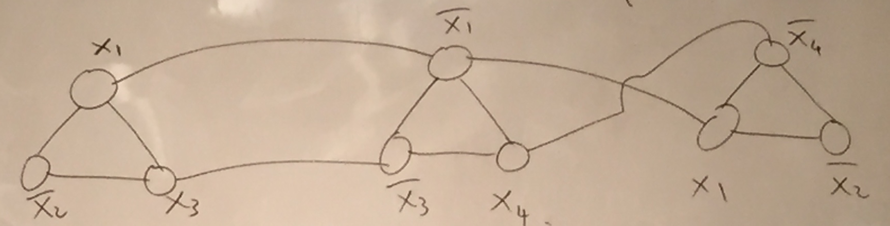
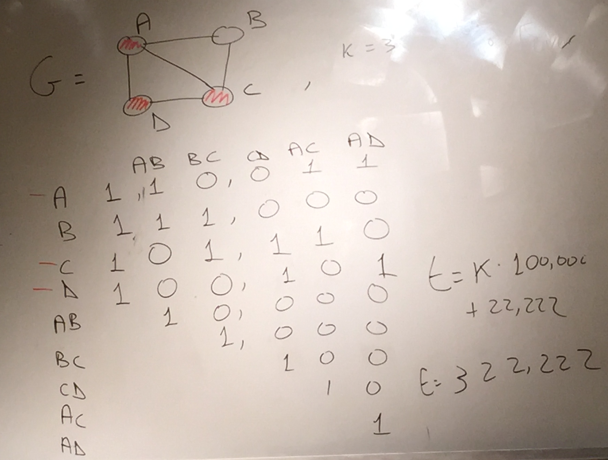

Before the break, we showed that every problem in $$\mathbf{NP}$$ reduced
onto CKT-SAT which in turn reduced onto 3SAT. Today, we will show
that 3SAT reduces onto clique, independent set, and vertex cover,
which in turn reduce to Steiner tree and subset sum, partitionin,
scheduling, and bin packing.

The fact that CKT-SAT and 3-SAT are NP-complete is referred to as
the Cook-Levin theorem.

###Independent Set

Given an undirected graph $$G=(V,E)$$, we define $$I\subseteq V$$ as
an independent set if for all $$u,v\in I$$, $$(u,v)\notin E$$. The max
independent set problem asks for the largest independent set of a
given graph $$G$$. As a language, we define the language of independent
sets as the set of pairs $$(G,k)$$ such that $$G$$ has an indpendent
set of size greater than or equal to $$k$$.

If this language is decidable in polynomial time, we can find the
size of the largest independent set in polynomial time as well by
using a plugging in various values of $$k$$ and testing whether $$(G,k)$$
is a member of the language. Once we have a way to find the size of
the largest independent set, we can find the actual independent set
simply by removing vertices and checking to see if the size changed
(if so, the vertex must be a part of the largest independent set).

We now wish to show that 3SAT reduces onto independent set.

The reduction operates as follows: suppose we have a clause

$$
\phi=(x_{1}\vee\overline{x_{2}}\vee x_{3})\wedge(\overline{x_{1}}\vee\overline{x_{3}}\vee x_{4})\wedge(x_{1}\vee\overline{x_{2}}\vee\overline{x_{4}})...
$$

Now for each 3-sat clause, create graph $$G$$ as follows: start with
a triangle with each vertex labeled with a literal. Now connect all
the vertices (from different triangles) whose literals are complementary,
e.g. $$x_{1}$$ and $$\overline{x_{1}}$$. Obviously $$G$$ has $$3m$$ vertices,
where $$m$$ is the number of clauses.

Claim: there exists an assignment that satisfies at least $$k$$ clauses
of $$\phi$$ if and only if there is an independent set in $$G$$ of size
at least $$k$$.

Proof of claim: Suppose there is a satisfying assignment of at least
$$k$$. For each triangle, if there is a vertex whose literal is true
in the assignment, pick an arbitrary vertex in the triangle whose
label is true to put it into the independent set (don't pick any if
the clause is false). Note that since the assignment satisfies least
$$k$$ clauses, then (since we pick one from each clause), there must
be at least $$k$$ triangles with a vertex in it (and each triangle
has at most one edge in the set by construction); as for edges between
triangles, note that we will never pick both vertices since the edges
have contradictory edges. Therefore, this is an independent set of
size at least $$k$$.

Conversely, suppose there is an independent set in $$G$$ of size at
least $$k$$. If a literal $$x$$ appears in the independent set, set
it as true. If its complement $$\overline{x}$$ appears in the independent
set, then set it as false. If neither appears, then set it arbitrarily.
Since we have edges connecting $$x$$ and $$\bar{x}$$, this assignment
is consistent. Furthermore, note that since we cannot have two vertices
from the independent set in the same triangle (otherwise it wouldn't
be an independent set), at least $$k$$ triangles must have at least
one vertex in the independent set; by definition, these vertices correspond
to assignments that satisfy the clause corresponding to the triangle.
Therefore, we must satisfy at least $$k$$ clauses.

###Clique and Vertex Cover

Given an undirected graph $$G=(V,E)$$, define a subset $$K\subseteq V$$
as a clique if for all $$u,v\in K$$, $$(u,v)\in E$$. Define a subset
$$C\subseteq V$$ as a vertex cover if for all $$(u,v)\in E$$, $$\{u,v\}\cap C$$
is nonempty.

We will show that vertex cover and clique both reduce to independent
set.

Note that for an undirected graph $$G=(V,E)$$, it follows directly
from the definitions that subset $$I$$ of vertices is an independent
set if and only if $$V\backslash I$$ is a vertex cover - since we cannot
have any edge which has two endpoints in the independent set, removing
all the vertices in the independent set leaves us with a set of vertices
which touches every single edge, which is the definition of a vertex
cover.

Therefore, $$(G,k)$$ is in the language of independent sets if and
only if $$(G,\vert V\vert-k)$$ is in the language of vertex covers.

Now define $$\overline{G}$$ as the complement of $$G=(V,E)$$: that is,
the edges of $$G$$ are the set of pairs of vertices from $$V$$ that
are not in $$E$$. An independent set in $$G$$ is a independent set in
$$\overline{G}$$ and vice versa; therefore, $$(G,k)$$ is in the language
of independent sets if and only if $$(\overline{G},k)$$ is in the language
of vertex covers.

###Subset Sum

Define subset sum as the following problem: given a multiset set of
integers $$a_{1},...,a_{n}$$ and and a target integer $$t$$, is there
some set $$I\subseteq\{1...n\}$$ such that $$\sum_{i\in I}a_{i}=t$$?

We will now reduce vertex cover to subset sum. Given a graph $$G=(V,E)$$,
we want to find if it has a vertex cover with $$k$$ vertices.

First, label these vertices using this scheme: each vertex corresponds
to a $$\vert E\vert$$-digit number; each digit in a number is $$1$$
if the corresponding edge is hit and $$0$$ otherwise. Note that if
we select thet vertices that we picked, then the digit value of the
sum is $$1$$ if the corresponding edge was hit once and $$2$$ if it
was hit twice; to make sure we can have an exact value (with two in
all decimal places), we assign each edge a number equal to $$1$$ in
its digit followed by zeros, and then tack ones onto the beginning
of the vertex numberings. 

We set our target to $$k\times10^{\vert E\vert}+22...2$$ where the
number $$22...2$$ has $$\vert E\vert$$ digits.

Notice that we must have $$k$$ vertices in order to get this sum (since
vertices are the only ones with ones in the $$10^{\vert E\vert}$$ digit,
and there cannot be any carry for digits lower than the highest bit),
and the sum of the labels of these vertices much have ones in all
digits except the first in order for the total sum to hit the target
(since the $$100...0$$ labels of the edges can only switch a $$1$$ to
a $$2$$, but cannot turn a $$0$$ into a $$2$$). Let $$C$$ be the set of
vertices corresponding to these vertex numbers; since their sum has
ones or twos in all of the lowest $$\vert E\vert$$ digits, they touch
all the edges, so we have a vertex cover.

Conversely, if we have a vertex cover, we can select the labels of
the elements in the vertex cover; since we are guaranteed to hit every
edge, all of the lowest $$\vert E\vert$$ digits of the sum are going
to be either $$1$$ or $$2$$; we can just pick the appropriate edge labels
to make them all $$2$$. This leads to a solution to the subset sum
solution.

###Partition

Define partition as follows: given integers $$a_{1},...,a_{n}$$, is
there some $$I\subseteq\{1...n\}$$ such that $$\sum_{i\in I}a_{i}=\sum_{a\notin I}a_{i}$$?

We will show that partition is NP-complete by reducing subset sum
onto it.

The idea is as follows: given a subset sum instance $$a_{1},...,a_{n},t$$,
we convert it to a partition instance $$a_{1},...,a_{n},a_{n+1}$$ such
that $$a_{n+1}=\sum_{i=1}^{n}a_{i}-2t$$, assuming (without loss of
generality) that $$t\leq\frac{1}{2}\sum_{i=1}^{n}a_{n}$$.

Now we wish to prove that the reduction works.

Let $$A=\sum_{i=1}^{n}a_{n}$$. Notice that $$A+a_{n+1}=A+A-2t=2A-2t$$.

Suppose that there is a satisfying subset sum instance. Then we can
take the numbers that sum up to $$t$$, put them in one side of the
partition with $$a_{n+1}=A-2t$$; therefore, the sum of that partition
is $$A-t$$, which means that the set has a partition into two subsets
with equal totals, as desired.

Conversely, suppose we are presented with a solution to our partition
problem. Now we want to show that the partition exists. Look at the
partition where $$a_{n+1}=A-2t$$ was placed. We know the sum of the
elements of the whole partition is $$A-t$$, so the sum of the elements
of the partition, excluding $$a_{n+1}$$, is $$A-t-(A-2t)=t$$ which gives
us a subset that sums to $$t$$.

Therefore, our reduction is valid.
